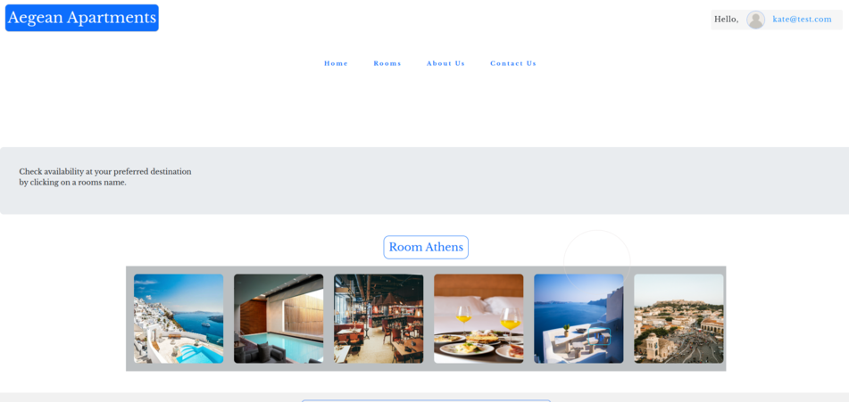
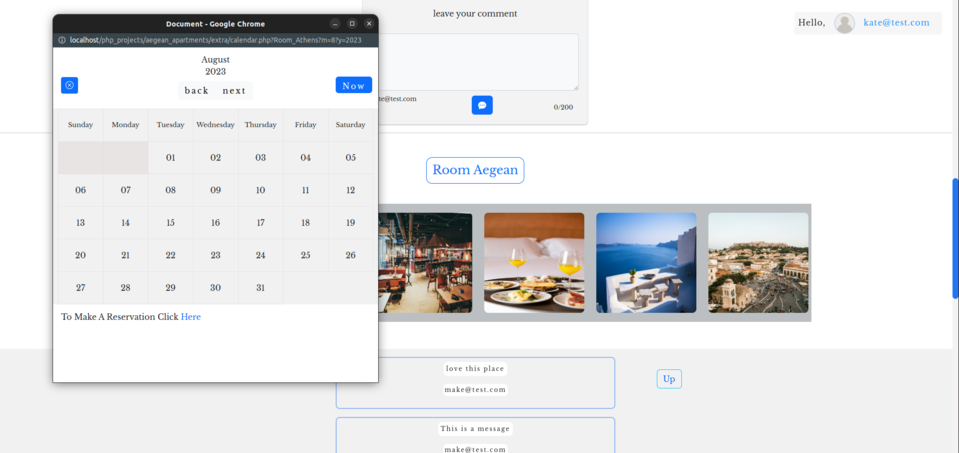
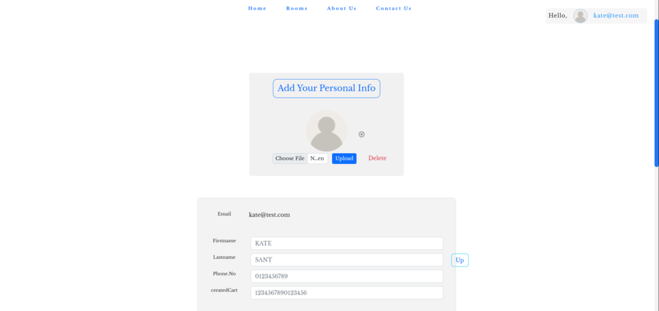
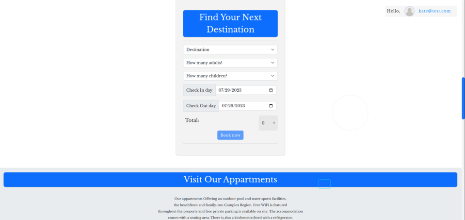

# Aegean_Apartments

room rental website👋

## Table of contents

- [What is about](#what-is-about)
- [Screenshot](#screenshot)
- [Built with](#built-with)
- [Sql-Datadase](#built-with)
- [Author](#author)

### What is about

Users should be able to:

- LoginIn /SignIn/LogOut fuctionality 
- Booking Form / cost for the booking
- Custom Calendar for Available rooms 
- Leave Comment section
- Message section 
- Import personal info and profile picture.
- For all the above operations I have applied the validation function as well

### Screenshot

### Built with

- PHP - SQL / Mysqli
- HTML5 markup
- Vanila javascript
- Regex expresions(validation)
 

    **** For styling ****

- CSS custom properties
- Responsive desigh 
- Bootstrap 5
- Google fonts
- Animations (Animate.css)

## Sql-Datadase
- Name: testLogin
   - bookings (make a booking)
   - comments (users can add  commenets in every room)
   - messages (sent a email to database)
   - users (users accounts and personal info)

## Author
- myportfolio - [Katerina Sarantopoulou](https://myportfolio-katesarant.netlify.app/)
- Frontend Mentor - [@kate-sarant](https://www.frontendmentor.io/profile/kate-sarant)
- Github - [kate-sarant](https://github.com/kate-sarant)
- email -[kate_sarant@yahoo.gr]